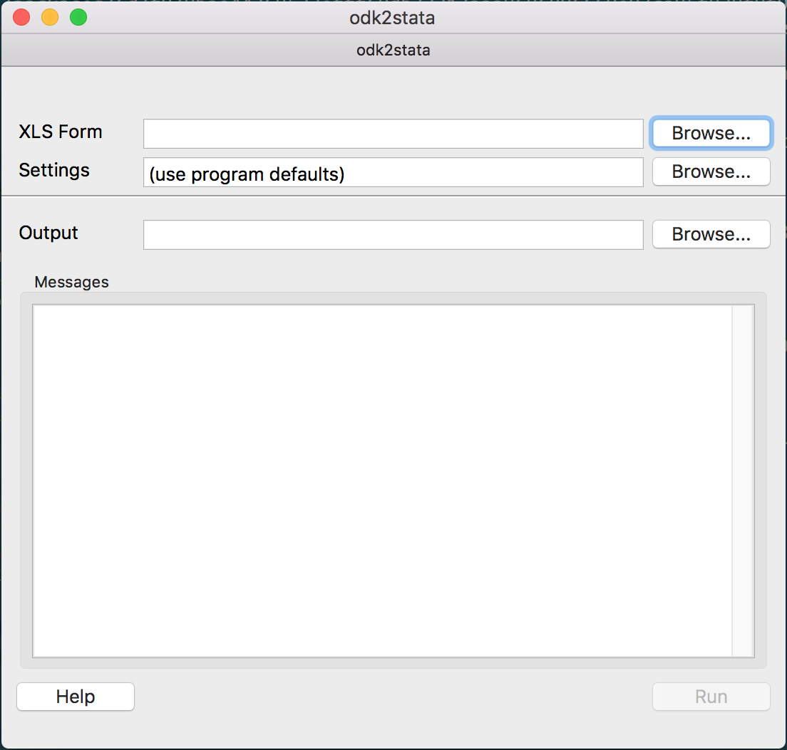

Usage
=====

Installation of ``odk2stata`` provides two command line scripts.
The first command line script launches a GUI::

  $ odk2stata-gui

The second runs the command line interface (notice here the added ``-h`` flag to get help messaging)::

  $ odk2stata -h

.. literalinclude:: includes/odk2stata_help.txt

Common usage for ``odk2stata`` looks like::

  $ odk2stata -s configuration.ini /path/to/odk/form.xlsx -o /path/to/output/form.do

The ``configuration.ini`` is a configuration file and will be described later.
The command line takes the path to the ODK file and a specified output file. If no output path is supplied, then
the resulting do file is printed to standard out.

